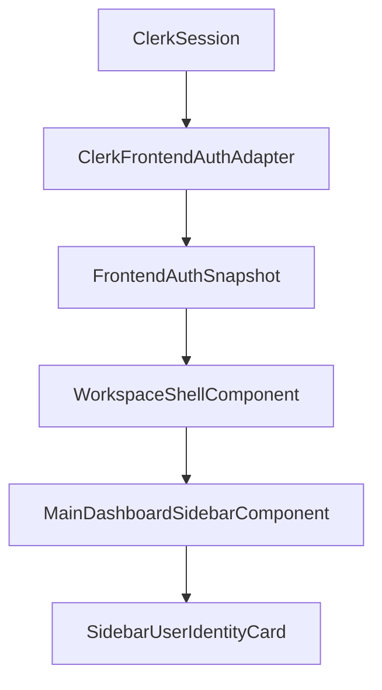

# Design: Sidebar User Mini Profile

## Technical Approach

The sidebar identity section reads authenticated data already available in the frontend session snapshot. We extend the snapshot contract with `avatarUrl?: string | null`, map it in the Clerk adapter, and pass `displayName` + `avatarUrl` from workspace shell into the sidebar component. Rendering stays local to the sidebar with safe guards and a fallback avatar token.

## Architecture Decisions

| Decision           | Options                                   | Choice                                      | Rationale                                                              |
| ------------------ | ----------------------------------------- | ------------------------------------------- | ---------------------------------------------------------------------- |
| Avatar data source | New API endpoint; Clerk session snapshot  | Clerk session snapshot                      | Zero backend changes and immediate consistency with current auth state |
| Fallback strategy  | Generic icon; initials                    | Initials from display name                  | Keeps personalized identity signal when no image is available          |
| Sidebar ownership  | Compute in shell only; compute in sidebar | Pass raw props, compute fallback in sidebar | Keeps template bindings clean and presentation logic colocated         |

## Data Flow

## File Changes

| File                                                                                                                  | Action | Description                                                             |
| --------------------------------------------------------------------------------------------------------------------- | ------ | ----------------------------------------------------------------------- |
| `apps/web/src/app/shared/auth/models/frontend-auth.model.ts`                                                          | Modify | Add optional `avatarUrl` to `FrontendAuthSnapshot` and loading constant |
| `apps/web/src/app/shared/auth/clerk-frontend-auth.adapter.ts`                                                         | Modify | Map Clerk `imageUrl` into snapshot for authenticated users              |
| `apps/web/src/app/shared/auth/clerk-frontend-auth.adapter.spec.ts`                                                    | Modify | Assert avatar mapping in signed-in snapshot                             |
| `apps/web/src/app/shared/auth/auth.guard.spec.ts`                                                                     | Modify | Update snapshot test fixture shape                                      |
| `apps/web/src/app/features/workspace-shell/workspace-shell.component.html`                                            | Modify | Provide user display name and avatar inputs to sidebar                  |
| `apps/web/src/app/features/main-dashboard/components/main-dashboard-sidebar/main-dashboard-sidebar.component.ts`      | Modify | Add user inputs and fallback initials computed signal                   |
| `apps/web/src/app/features/main-dashboard/components/main-dashboard-sidebar/main-dashboard-sidebar.component.html`    | Modify | Insert mini user section between active card and sign-out               |
| `apps/web/src/app/features/main-dashboard/components/main-dashboard-sidebar/main-dashboard-sidebar.component.css`     | Modify | Add compact styles for avatar/name row                                  |
| `apps/web/src/app/features/main-dashboard/components/main-dashboard-sidebar/main-dashboard-sidebar.component.spec.ts` | Modify | Cover rendering with avatar and fallback initials                       |

## Testing Strategy

| Layer      | What to Test                                      | Approach                                   |
| ---------- | ------------------------------------------------- | ------------------------------------------ |
| Unit       | Auth snapshot includes `avatarUrl`                | `clerk-frontend-auth.adapter.spec.ts`      |
| Unit       | Sidebar renders name/avatar and fallback initials | `main-dashboard-sidebar.component.spec.ts` |
| Regression | Sign-out and nav behavior unchanged               | Existing sidebar specs remain green        |
